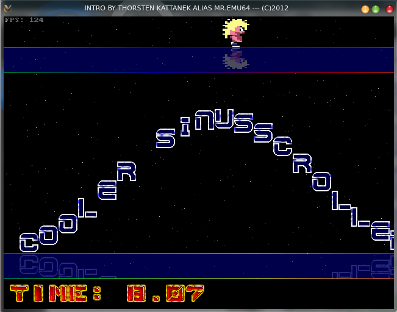

# Oldscool Intro
A oldscool intro with sdl2
### [Latest version here](https://github.com/ThKattanek/oldscool_intro/releases)



## Used libraries
* SDL2
* SLD2_image
* SDL2_gfx
* SDL2_mixer

## Compiling and installing
```bash
cd ~
git clone https://github.com/ThKattanek/oldscool_intro.git
cd oldscool_intro
mkdir build
cd build
cmake .. -DCMAKE_INSTALL_PREFIX=/usr/local
make
make install
```
## Compiling for Windows x32 with MXE (Crossdev)
```bash
cd ~
git clone https://github.com/ThKattanek/oldscool_intro.git
cd oldscool_intro
mkdir build-win-x32
cd build-win-x32
[MXE-PATH]/usr/bin/i686-w64-mingw32.static-cmake .. -DWIN32_STATIC_BUILD=TRUE
make
```
## Compiling for Windows x64 with MXE (Crossdev)
```bash
cd ~
git clone https://github.com/ThKattanek/oldscool_intro.git
cd oldscool_intro
mkdir build-win-x64
cd build-win-x64
[MXE-PATH]/usr/bin/x86_64-w64-mingw32.static-cmake .. -DWIN32_STATIC_BUILD=TRUE
make
```
## Complete build and create the windows versions (32/64bit) as 7zip with Script (crossbuild_win_releases.sh)
#### MXE required
```bash
cd ~
git clone https://github.com/ThKattanek/oldscool_intro.git
cd oldscool_intro
./crossbuild_win_releases.sh [MXE-PATH]
```
### [MXE Website](http://mxe.cc)
